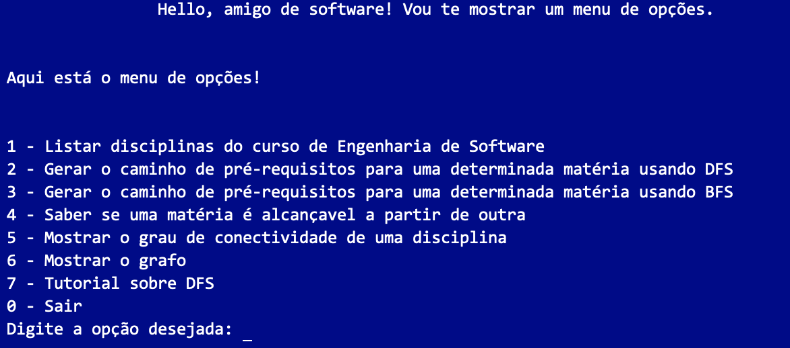

# Sistema de Matrícula

**Número da Lista**: 1<br>
**Conteúdo da Disciplina**: Grafos 1<br>

## Alunos
|Matrícula | Aluno |
| -- | -- |
| 16/0133394  |  Lucas Fellipe Carvalho Moreira |
| 15/0009917  |  Gabriel Alves S. de Souza |

## Sobre
<p>
Dentro da Universidade há uma grande dificuldade em achar o fluxo de uma matéria em específico, por vezes, essas matérias possuem várias outras como pré-requisito. Tendo em vista essa dificuldade, desenvolvelmos uma aplicação na qual você poderá achar o fluxo de uma matéria em específico do curso de Engenharia de Software da Universidade de Brasília.
</p>
<p>
Como base, utilizamos a estrutura de Grafos para a implementação desse aplicativo. E além disso, você poderá aprender um pouco como funciona a DFS, com o nosso tutorial interativo. Então divirta-se e aprenda bastante com esse projeto!
</p>

## Screenshots
Adicione 3 ou mais screenshots do projeto em funcionamento.

## Instalação 
**Linguagem**: C++17<br>
**Pré-requisitos**: C++17 e o Makefile
**Execução do Projeto:**

* Clone o repositório

  ```git clone https://github.com/projeto-de-algoritmos/Grafos1_Sistema-de-Matricula.git```

* Acesse o repositório e digite:

  ```cd Grafos1_Sistema-de-Matricula``` e digite ```make```

* Logo em seguida, digite:

  ```make run``` e aproveite com as opções do menu.

* Quando acabar de usar o projeto, digite:

  ```make clean``` para apagar os arquivos da pasta bin e da pasta obj.

## Uso 

Para usar, basta digitar as opções do menu:



Opções:

* 1 - Lista todas as disciplinas do currículo de *software* da Universidade de Brasília - UnB;
* 2 - Realiza uma busca em profundidade (DFS) para saber quais são os pré-requisitos de uma determinada disciplina;
* 3 - Realiza uma busca em largura (BFS) para saber quais são os pré-requisitos de uma determinada disciplina;
* 4 - Mostra se é possível chegar em uma disciplina a partir de outra disciplina usando a busca em largura (BFS);
* 5 - Mostra o grau de conectividade de um vértice especifíco com todos os outros vértices;
* 6 - Mostra o grafo;
* 0 - Sair.


